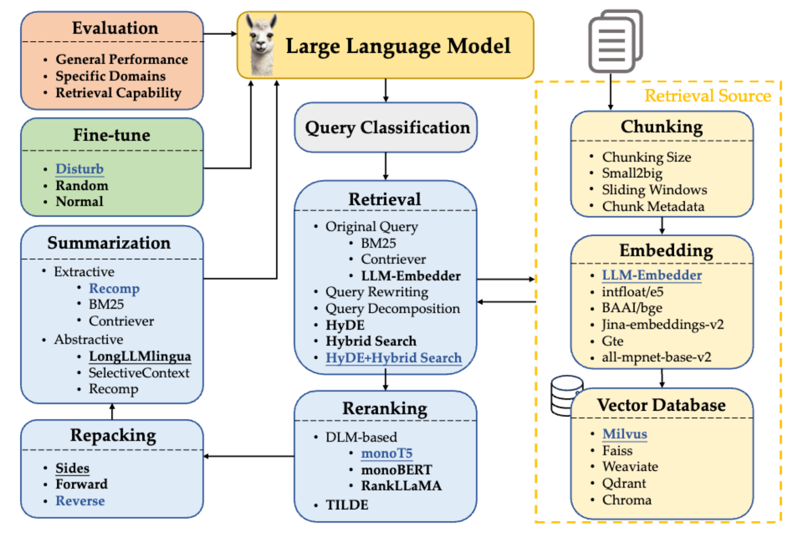

# RAGGA

## Introduction

This is an implementation of the paper: 

<a href="https://arxiv.org/pdf/2407.01219">Searching for Best Practices in Retrieval-Augmented Generation</a>

  

## Installation
#### Create conda environment
```
conda create --name RAGGA python=3.10 pytorch torchvision pytorch-cuda -c nvidia -c pytorch -y
conda activate RAGGA
git clone https://github.com/FudanDNN-NLP/RAG.git
cd RAG/opencompass
pip install -e .
```
#### Install Java for Linux
```
wget https://download.java.net/java/GA/jdk11/13/GPL/openjdk-11.0.1_linux-x64_bin.tar.gz
mkdir ~/java
tar -zxf openjdk-11.0.1_linux-x64_bin.tar.gz -C ~/java
```
Add the following statements into `` ~/.bashrc ``:
```
export JAVA_HOME=~/java/openjdk-11.0.1
export JRE_HOME=$JAVA_HOME/jre
export CLASSPATH=.:$JAVA_HOME/lib:$JRE_HOME/lib:$CLASSPATH
export PATH=$JAVA_HOME/bin:$JRE_HOME/bin:$PATH
export JVM_PATH=$JAVA_HOME/lib/server/libjvm.so
```
Then run `` source ~/.bashrc `` to activate the environment variable changes to the current user.

## **Reproducibility** 
You can run the evaluation of best practices and efficiency practices in the paper by:
```
cd RAG/opencompass
bash eval.sh
```


## Citation
If you use this code in your work, please cite our paper:
```
@inproceedings{Wang2024SearchingFB,
  title={Searching for Best Practices in Retrieval-Augmented Generation},
  author={Xiaohua Wang and Zhenghua Wang and Xuan Gao and Feiran Zhang and Yixin Wu and Zhibo Xu and Tianyuan Shi and Zhengyuan Wang and Shizheng Li and Qi Qian and Ruicheng Yin and Changze Lv and Xiaoqing Zheng and Xuanjing Huang},
  year={2024},
  url={https://api.semanticscholar.org/CorpusID:270870251}
}
```

