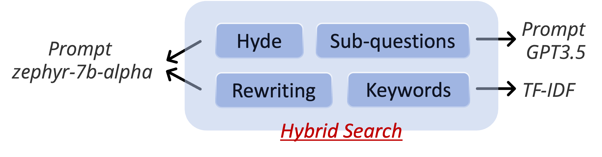

# RAGGA-Retriever

A `.gitignore` magician in your command line. Joe generates `.gitignore` files from the command line for you.



## Features

- [Pseudo-documents Generation](https://arxiv.org/abs/2212.10496)
- Query Rewriting
- Query decomposition
- hybrid Search

## Installation

```bash
$ pip install -r requirements.txt
```

## Index Custom Corpora

### Bulid a BM25 Index

```bash
$ bash bulid_bm25_index.sh
```

### Build a Dense Vector Index

```bash
$ 
```

## Retrieval

Conduct retrieval with different specific parameters:

```bash
$ bash run_search.sh
```